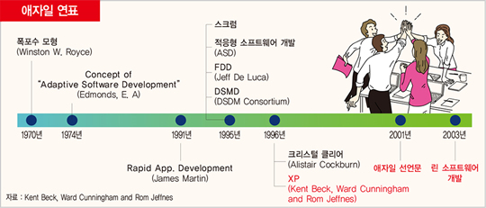

### **2. 애자일 방법론과 데브옵스의 유래**
---

데브옵스를 이해하기 전에 데브옵스에 많은 영향을 준 개발방법론에 대해 알아보자.
1990 년대는 기존의 대규모 개발에 대한 반작용으로 경량화된 개발방법론이 발전되었으며, 1991 년엔느 빠른 애플리케이션 개발 방법인 RAD가 나왔고, 1995 년에는 스크럼 개발 방법이 나왔다. 그리고 1996 년에는 극단적인 프로그래밍 방법론을 의미하는 XP가 발표되었다.



2001년 17명의 소프트웨어 개발자들이 유타에서 모여 경량화된 개발방법론에 대해 논의했는데, 여기서 애자일 소프트웨어 개발을 위한 선언문을 발표하게 된다. 17 명의 소프트웨어 중에는 유명한 개발자들이 대거 포함되어 있었다.

애자일 개발방법론(Agile Software Development)은 소프트웨어 개발 방법에 있어 아무런 계획이 없는 개발 방법과 계획이 지나치게 많은 개발 방법들 사이에서 타협점을 찾고자 하는 방법론이다. 고전적인 개발방법론은 초기에 수립된 계획에 너무 의존하며, 프로그램 개발 과정 중 발생되는 추가적인 요구사항 및 변화에 적절하게 대응하지 못하고, 전체적인 개발의 흐름 자체를 느리게 하는 단점을 가지고 있다. 반대로 계획을 수립하지 ㅇ낳고 진행되는 개발의 경우 앞으로의 일을 예측하기 힘들고 효율적이지 못하다는 점에서 취약점을 가지고 있으며, 일정 계획과 목표를 갖고 진행하기 어렵다는 단점을 가지고 있다.

애자일 방법론은 두 가지에 대해 적절한 타협접을 제시하는 방법론이다. 애자일 방법론이 다른 고전적인 방법론, 예컨대 폭포수 모델 또는 나선 모형과 구별되는 가장 큰 차이점은 less document-orineted 즉, 문서를 통한 개발 방법이 아니라 code-oriented 실질적인 코딩을 통한 방법론이라는 점이다.

애자일 개발 방법론은 계획을 통해 주도해 나갔던 과거의 방법론과는 다르게 앞을 예측하며 개발하지 않고, 일정한 주기를 가지고 끊임없이 프로토타입을 만들어내며 그때 그때 필요한 요구를 더하고 수정하여 하나의 커다란 소프트웨어를 개발해 나가는 Adaptive Style이라고 할 수 있다.

이런 애자일 방법론은 타당성 조사, 요구 조건 분석, 외부 설계 문서 작성, 프로그램 사양 작성, 코드 작성, 테스트, 그리고 제작같은 일련의 단계를 순차적으로 진행하는 폭포수(waterfall) 방법론에 대한 해결책으로 여겨졌다.

폭포수 모델은 사전에 매우 상세한 기능 요구 조건을 작성할 것을 요구하며, 이런 요구 조건은 거의 일방적으로 개발자들에게 넘겨지고, 개발자들이 정의/분석한 요구사항을 토대로 개발을 진행해 나간다. 하지만 적지 않은 빈도로 프로젝트의 결과물은 이해 당사자들이 원하던 결과물이 아닌 일이 발생된다. 그 이유는 요구사항 분석 시 잘못된 분석과 진행 중 발생될 수 있는 분석/설계의 결과물에 상호 합의와 확인이 부족한 경우 빈번하게 발생할 수 있는 문제점이다.

이런 문제점을 토대로 17명의 개발자들은 다음과 같은 12가지의 애자일 소프트웨어 개발 원칙을 발표했다.

```
* 애자일 소프트웨어 개발 원칙 12가지

1. 우리의 최우선 순위는 가치있는 소프트웨어를 일찍, 그리고 지속적으로 전달해서 고객을 만족시키는 것이다.
2. 비록 개발의 후반부일지라도 요구사항 변경을 환영하라. 애자일 프로세스들은 변화를 활용해 경쟁력에 도움이 되게 한다.
3. 작동하는 소프트웨어를 자주 전달하라. 2주에서 2개월 간격으로 하되, 더 짧은 기간을 선호하라.
4. 비즈니스 쪽의 사람들과 개발자들은 프로젝트 전체에 걸쳐 날마다 함께 일해야 한다.
5. 동기가 부여된 개인을 중심으로 프로젝트를 구성하라. 그들이 필요로 하는 환경과 지원을 주고 그들이 일을 끝내리라고 신뢰하라.
6. 개발팀, 개발팀 내부에서 정보를 전달하는 가장 효율적이고 효과적인 방법은 면대면 대화이다.
7. 작동하는 소프트웨어가 진척의 주된 척도이다.
8. 애자일 프로세스들은 지속 가능한 개발을 장려하다. 스폰서, 개발자, 사용자는 일정한 속도를 계속 유지할 수 있어야 한다.
9. 기술적 탁월성과 좋은 설계에 대한 지속적 관심이 민첩성을 높인다.
10. 단순성 즉, 안 하는 일의 양을 최대화하는 기술이 필수적이다.
11. 최고의 아키텍처, 요구사항, 설계는 스스로 조직된 팀에서 나온다.
12. 팀은 정기적으로 어떻게 더 효과적이 될지 숙고하고, 이에 따라 팀의 행동을 조율하고 조정한다.
```

애자일 개발방법론의 도입은 개발팀에서 많은 변화를 촉발하였다. 더 빨라진 소프트웨어 배포, 더 소소하고 빈번해진 소프트웨어 빌드, 새로운 요구 조건에 대한 빠른 개발과 응대 등이다. 하지만 이런 개발방법론의 도입은 운영팀에게 많은 부하와 운영적인 문제점을 촉발하게 되었다. 이로 인해 개발팀과 운영팀 간의 충돌과 이슈가 발생하게 된다. 이에 대한 개선의 요구로 배포, 테스트, 빌드 등 개발과 운영의 전반적인 주기 자동화에 대한 필요성이 대두되었고, 데브옵스가 등장하게 된다.