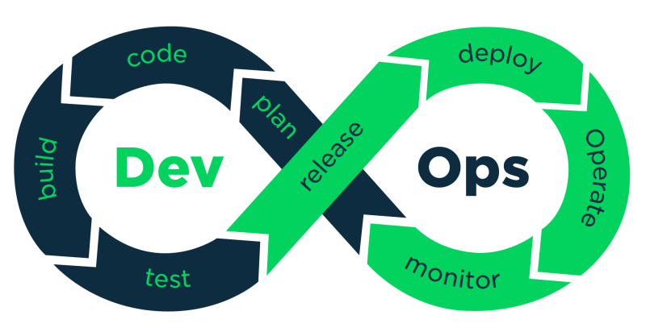

### **데브옵스란?**
---

데브옵스(DevOps)는 소프트웨어의 개발(Development)과 운영(Operation)의 합성어로서, 소프트웨어 개발자와 정보기술 전문가 간의 소통,
협업, 및 통합을 강조하는 개발 환경이나 문화를 말한다. 또한 데브옵스는 소프트웨어 개발 조직과 운영 조직 간의 상호 의존적 대응이며 
조직이 소프트웨어 제품과 서비스를 빠른 시간에 개발 및 배포하는 것을 목적으로 한다.

기업에서 일반적으로 소프트웨어를 개발하기 위해서는 여러 사람이 동시에 시스템을 개발하기 위한 개발 환경과 개발된 서비스 제공을 위한
IT 인프라와 시스템도 필요하고, 이러한 시스템을 운영하기 위한 운영자도 필요하다. 일반적인 기업에서는 IT 서비스를 개발하는 개발팀과 개발된 서비스를 고객에게 제공하며 운영하는 운영팀으로 나누어지게 되며, 두 팀은 서로 다른 목적을 갖고 다른 프로세스로와 툴로 개발과
운영을 진항하게 된다.

개발자(Dev)는 고객의 요구사항을 빠르게 수용해서 서비스를 개발하고, 개발된 내용을 빠르게 적응하고 확인하길 원하며, 운영자(Ops)는 제공될 서비스가 정확하게 동작하며, 테스트 되었고, 성능적 문제가 없으며, 다른 시스템에 영향을 주지 않고 안정적으로 동작하기를 원한다.
IT 서비스에 대해 프로세스, 도구의 차이, 그리고 서로 다른 목적 등으로 인해 개발팀과 운영팀에 충돌이 빈번히 발생하게 된다. 이러한 고민에서 데브옵스(DevOps)라는 개념이 출현하게 된다.

이렇게 데브옵스(DevOps)의 정의가 폭넓은 이유는 데브옵스(DevOps)의 시작이 개발팀과 운영팀 간의 충돌에 대한 문제 해결이기 때문이며, 근본적인 문제 해결을 위해서는 시스템과 프로그램 도입 이외에, 개발팀과 운영팀의 협업과 소통 및 통합 그리고 문화적 개선 등 다양한 노력을 수반하기 때문이다. 데브옵스(DevOps)를 누가, 언제, 어떻게 시작했는지 알게 된다면 데브옵스(DevOps)의 정의를 이해하는 데 도움이 될 것이다.